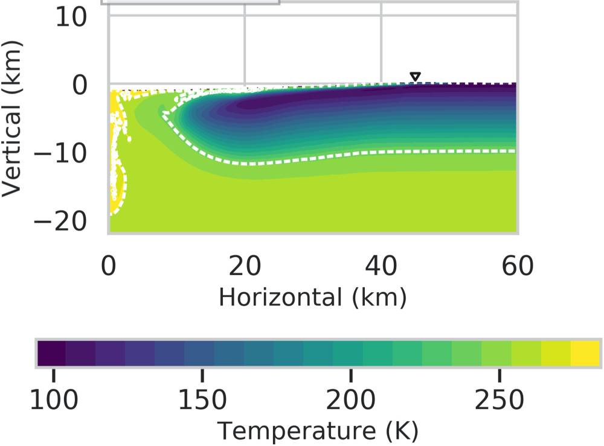

# python-colormap-image-digitizer

This short python script reads an image (JPG/PNG) made with a specific colormap in Python and converts it to another colormap as well as extracts out values.

## Affiliation
Oden Institute for Computational Engineering and Sciences / Jackson School of Geosciences / University of Texas Institute for Geophysics / NASA Jet Propulsion Lab

## Getting Started

### Steps
1. Crop the initial image (Figure 1) using other software

Figure: Initial uncropped JPG image made in viridis colormap.

2. Read the cropped image (Figure 2)

Figure: Cropped image made in viridis colormap.

3. In the code, mention the input colormap (needs to be in Python).

4. Make the map between the input and output colormap.

### Dependences

hyperbolic-infiltration-theory requires the following packages to function:
- [Python](https://www.python.org/) version 3.5+
- [Numpy](http://www.numpy.org/) >= 1.16
- [scipy](https://www.scipy.org/) >=1.5
- [matplotlib](https://matplotlib.org/) >=3.3.4

### Quick Usage
Run the `image-digitizer.py` Python script.

### What is happening in the code
We make a one-to-one map in between input colormap (RGB) and the Greys (g) colormap. For that we first define the two maps. Then solve for the coefficients `a`,`b`,`c`:

`g  = a*R + b*G + c*B`

For the complete, discretized colormap we can write

`b   = A * X`
with
`b = [g_1;g_2;g_3,...], A = [R_1,G_1,B_1; R_2,G_2,B_2; ...]` and `X = [a;b;c]`

So, `X = (A^T A)^{-1} A^T b`

Once we find the color vector `X`, we multiply the RGB array in each pixel with it.
